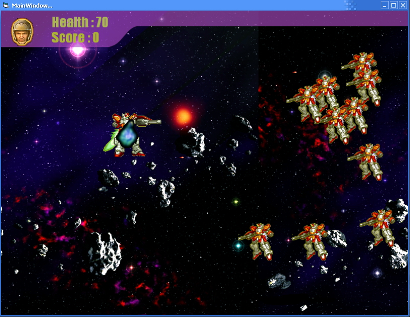



## Spacewar\(2D Game Engine\)

### Description

Hi guys, this is my first contribution in our source code planet, I hope you enjoy it.

This is an intermediate 2D game engine based on DirectX8.1 and it will be very helpful for those who are newbie.

The engine is submitted with a sample demo of a "Space War" game. The engine is capable of playing videos, sounds and music.

For the sample demo you have to install the DivX codec in order to get the video played. Also the video has no sound (so that I can make my uploaded file as small as possible) but it can play any video with sound. You can bypass the Intro video by pressing escape to move to a dummy main menu(it is still in process) and then you move to the first(and the last J)level of the game.

You have to play with the "Gundam" hero to defeat the bad robots. Use the space bar to shot and the arrows to move. One problem with my code is while you are pressing two direction buttons simultaneously the space pare doesn't fire I don't know why. If anyone knows I will be glad to hear from him.

If you let yourself lose then when the health gauge reaches zero the game will end showing the message "Game Over", while if you win the message "Level Complete" will be shown. This is done by writing directly with any font you want from your system to the screen.

The game supports both fullscreen and window mode. Curently it runs in window mode for debugging purpose but with a littel code modification with the ini file it can run in fullscreen.

<b>I'm so upset because no one voted me till now.Please vote.</b>
 
### More Info
 

             |
---                |---
**Submitted On**   |2008-11-08 08:46:20
**By**             |[Mustafa Salah](https://github.com/Planet-Source-Code/PSCIndex/blob/master/ByAuthor/mustafa-salah.md)
**Level**          |Intermediate
**User Rating**    |4.4 (40 globes from 9 users)
**Compatibility**  |VB 6\.0
**Category**       |[Games](https://github.com/Planet-Source-Code/PSCIndex/blob/master/ByCategory/games__1-38.md)
**World**          |[Visual Basic](https://github.com/Planet-Source-Code/PSCIndex/blob/master/ByWorld/visual-basic.md)
**Archive File**   |[spacewar2133441182008\.zip](https://github.com/Planet-Source-Code/mustafa-salah-spacewar-2d-game-engine__1-71367/archive/master.zip)

